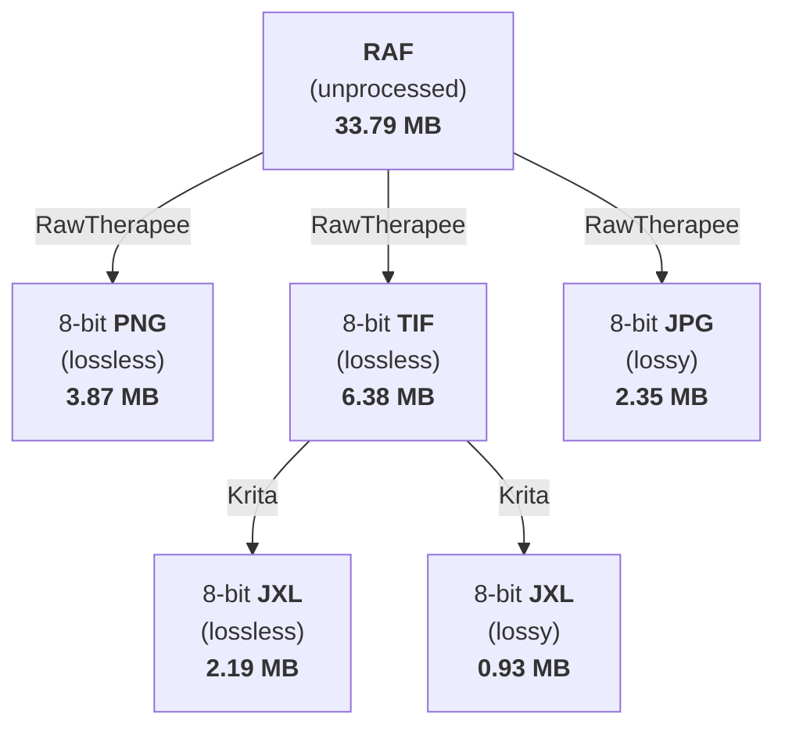

<h1>File-Size Comparison Test</h1>

```mermaid 
    graph TD
    A["<b>RAF</b><br>(unprocessed)</br><b>33.79 MB</b>"] -- RawTherapee --> B["8-bit <b>PNG</b><br>(lossless)<br><b>3.87 MB</b>"]
    A["<b>RAF</b><br>(unprocessed)</br><b>33.79 MB</b>"] -- RawTherapee --> C["<b>TIF</b><br>(lossless)</br><b>33.79 MB</b>"]
    A["<b>RAF</b><br>(unprocessed)</br><b>33.79 MB</b>"] -- RawTherapee --> D["8-bit <b>JPG</b><br>(lossy)<br><b>2.35 MB</b>"]
    C["8-bit <b>TIF</b><br>(lossless)<br><b>6.38 MB</b>"] -- Krita --> E["8-bit <b>JXL</b><br>(lossless)<br><b>2.19 MB</b>"]
    C["8-bit <b>TIF</b><br>(lossless)<br><b>6.38 MB</b>"] -- Krita --> F["8-bit <b>JXL</b><br>(lossy)<br><b>0.93 MB</b>"]
```

All image formats were processed at the highest quality settings.

